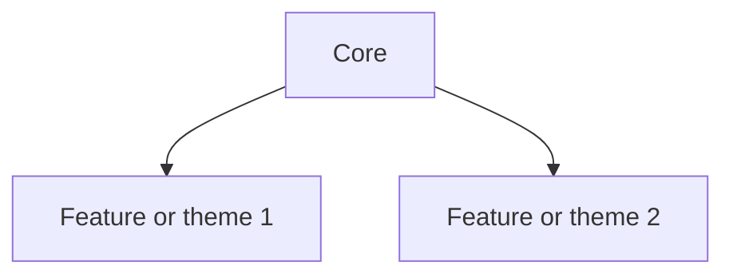
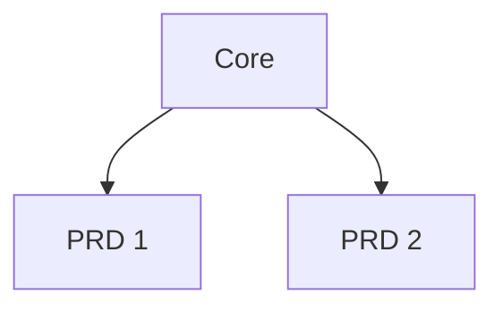

# Skillgrid workflow

**Runnable steps** live in the slash commands (e.g. `.cursor/commands/skillgrid-*.md`, mirrored under `.kilo/commands/`, `.opencode/commands/`, `.github/prompts/`). The sections below are a compact index; open the matching `skillgrid-*` file for the full checklist and skill paths.

Full indexes: [agents.md](agents.md), [skills.md](skills.md), [commands.md](commands.md), [tools.md](tools.md).

```bash
/skillgrid-init
# Create skillgrid folder structure
# Detect if the project is greenfield or brownfield
## If greenfield:
## If brownfield: Tell the user to use /skillgrid-explore because it is a brownfield project.
# index memory
## graphify init
## CocoIndex init
### Skills (.agents/skills/)
- karpathy-guidelines — assumptions, simplicity, surgical edits 
- sdd-init — bootstrap SDD context: stack, conventions, persistence
- ccc — CocoIndex Code: `ccc init`, indexing, semantic search setup
- context-engineering — Feed agents the right information at the right time - rules files, context packing, MCP integrations

/skillgrid-explore
# Explore existing code
## Use openspec-explore
## Generate content for ARCHITECTURE.md, STRUCTURE.md, PROJECT.md
## Update AGENTS.md Prooject chapter
### Skills (.agents/skills/)
- openspec-explore — explore problem and codebase before a change
- ccc — semantic codebase search ccc search
- documentation-and-adrs - Architecture Decision Records, API docs, inline documentation standards - document the why

/skillgrid-brainstorm
# User describes what they want
## Ask back to clarify
## Search on the internet for good examples
### Skills (.agents/skills/)
- karpathy-guidelines — assumptions, simplicity, surgical edits 
- search-first — research tools and patterns before building
- deep-research — deeper investigation when exploration needs breadth
- idea-refine — Structured divergent/convergent thinking to turn vague ideas into concrete proposals
- documentation-lookup - Use up-to-date library and framework docs via Context7 MCP instead of training data. Activates for setup questions, API references, code examples, or when the user names a framework e.g. React, Next.js, Prisma.

/skillgrid-plan
## Generate prd for the function
## Use prd to generate openspec change with openspec-propose
### Skills (.agents/skills/)
- karpathy-guidelines — assumptions, simplicity, surgical edits 
- sdd-propose — proposal.md only SDD orchestrator / Engram or openspec mode
- spec-driven-development — Write a PRD covering objectives, commands, structure, code style, testing, and boundaries before any code

/skillgrid-design
# User describes how the page should look
## Generate DESIGN.md
### Skills (.agents/skills/)
- karpathy-guidelines — assumptions, simplicity, surgical edits 
- frontend-design - 
- frontend-ui-engineering — Component architecture, design systems, state management, responsive design, WCAG 2.1 AA accessibility
- sdd-propose — proposal.md only SDD orchestrator / Engram or openspec mode
- spec-driven-development — Write a PRD covering objectives, commands, structure, code style, testing, and boundaries before any code


/skillgrid-breakdown
# Break down the PRD into tasks
# Create tasks under openspec change.
### Skills (.agents/skills/)
- karpathy-guidelines — assumptions, simplicity, surgical edits 
- sdd-spec - 
- sdd-tasks — tasks.md checklist from proposal, specs, and design
- planning-and-task-breakdown — Decompose specs into small, verifiable tasks with acceptance criteria and dependency ordering
- test-driven-development - Red-Green-Refactor, test pyramid 80/15/5, test sizes, DAMP over DRY, Beyonce Rule, browser testing
- tdd-guide — TDD guidance and patterns
- source-driven-development — Ground every framework decision in official documentation - verify, cite sources, flag what is unverified
- ccc — refresh semantic index after significant code changes
# - clean-code — readability and maintainability while implementing

/skillgrid-apply
### Skills (.agents/skills/)
- karpathy-guidelines — assumptions, simplicity, surgical edits 
- openspec-apply-change — implement from OpenSpec change tasks
- api-and-interface-design - Contract-first design, Hyrum Law, One-Version Rule, error semantics, boundary validation

/skillgrid-test
### Skills (.agents/skills/)
- karpathy-guidelines — assumptions, simplicity, surgical edits 
- browser-testing-with-devtools - Chrome DevTools MCP for live runtime data - DOM inspection, console logs, network traces, performance profiling
- debugging-and-error-recovery — Five-step triage: reproduce, localize, reduce, fix, guard. Stop-the-line rule, safe fallbacks
- e2e-testing — end-to-end test design and implementation
- e2e-runner — run and troubleshoot E2E suites
- testing-patterns — general testing patterns beyond E2E

/skillgrid-review
# Automated QA testing
# Automated functional testing
# Ask user to validate code really works
### Skills (.agents/skills/)
- karpathy-guidelines — assumptions, simplicity, surgical edits 
- sdd-verify — SDD verification against specs, design, and tasks
- code-review-and-quality — Five-axis review, change sizing 100 lines, severity labels Nit/Optional/FYI, review speed norms, splitting strategies
- code-simplification - Chesterton Fence, Rule of 500, reduce complexity while preserving exact behavior
# clean-code — review for clarity and coupling
- documentation-and-adrs - Architecture Decision Records, API docs, inline documentation standards - document the why
- performance-optimization — Measure-first approach - Core Web Vitals targets, profiling workflows, bundle analysis, anti-pattern detection
#- database-reviewer — PostgreSQL schema, SQL, RLS, performance review

/skillgrid-security
# Security testing
### Skills (.agents/skills/)
- karpathy-guidelines — assumptions, simplicity, surgical edits 
- security-and-hardening — OWASP Top 10 prevention, auth patterns, secrets management, dependency auditing, three-tier boundary system
- security-review - Review code for security vulnerabilities and best practices
- semgrep-security — static analysis with Semgrep
- trivy-security — container/dep scanning with Trivy
- vulnerability-scanner — threat modeling and vuln prioritization (OWASP-oriented)
- security-scan — audit agent/IDE config (e.g. `.claude/`, MCP, hooks)
- deprecation-and-migration - Code-as-liability mindset, compulsory vs advisory deprecation, migration patterns, zombie code removal

/skillgrid-validate
# Combined gate: run the full /skillgrid-review checklist, then the full /skillgrid-security checklist (see skillgrid-validate command)
### Skills (.agents/skills/)
- karpathy-guidelines — assumptions, simplicity, surgical edits
- (plus every skill listed under /skillgrid-review and /skillgrid-security for that session)

/skillgrid-finish
# Archive change - openspec-archive-change
# Optional: sync delta specs to main specs - openspec-sync-specs
# Create PR
### Skills (.agents/skills/)
- karpathy-guidelines — assumptions, simplicity, surgical edits 
- openspec-archive-change — complete and archive the change (per your merge process)
- openspec-sync-specs — promote delta specs without archiving, if your flow needs it
- git-workflow-and-versioning — trunk-style workflow, atomic commits, small changes
- documentation-and-adrs - Architecture Decision Records, API docs, inline documentation standards - document the why
```

## Parallel discovery 

Parallel **subagents** for codebase mapping and domain research, you can **fan out** independent work, then **merge** in the main session:

- **Safe to run in parallel:** read-only **explore** passes on disjoint areas (e.g. different packages), **cited** landscape or prior-art research with non-overlapping briefs (stack vs competitors vs API docs), using personas such as `skillgrid-explore-architect` and `skillgrid-researcher` in separate subagent contexts when your harness allows concurrent `Task` / subagents.
- **Keep sequential:** `/skillgrid-plan` → optional `/skillgrid-design` → `/skillgrid-breakdown` so intent stays a single chain; then `/skillgrid-apply` and later gates follow their ordered phases.

Parallel fan-out and merge is the same orchestration idea as the **slash command (orchestrator — fan-out)** section in [`.cursor/agents/README.md`](../.cursor/agents/README.md): only when sub-tasks are **independent** (no shared mutable state, no required ordering). The hub’s `/skillgrid-validate` run may still be **sequential in one turn**; true wall-clock parallelism requires a harness with concurrent subagents.

## skillgrid Folder structure

```bash
project-root/
├── AGENTS.md
├── DESIGN.md
└── .skillgrid/
     ├── project
          ├── ARCHITECTURE.md - Architecture with mermaid graphs
          ├── STRUCTURE.md - Repository layout and (optional) runtime topology
          └── PROJECT.md
     └── prd
          ├── INDEX.md
          └── <change-or-feature-name>.md
```

**Templates** below match a common `project/` + `prd/` layout: a deep **architecture** write-up, a **project** onboarding doc, a **structure** doc for paths (and optional runtime topology—what many teams put in a separate `INFRASTRUCTURE.md`), and **PRD** index plus one file per change. In skillgrid, **STRUCTURE.md** holds repo tree and, if you use it, that deployment half in an optional section.

### `project/ARCHITECTURE.md` (template)

Use for **system design**: layers, major components, APIs, and cross-cutting concerns. Prefer mermaid for diagrams.

````markdown
# <Project Name> — System Architecture

> **Version:** <semver or date>
> **Last Updated:** <YYYY-MM-DD>
> **Status:** <Draft | Active | Superseded>

---

## Table of Contents

1. [Architecture overview](#1-architecture-overview)
2. [Application layers](#2-application-layers)
3. [<Domain-specific sections>](#) <!-- e.g. data, auth, plugins, API, frontend, security, multi-tenancy, errors -->

---

## 1. Architecture overview

<One paragraph: layered or modular mental model.>

### High-level system diagram

```mermaid
graph TB
  %% User / edge / app / data / external systems
```

### Design decisions

| Decision | Choice | Rationale |
| -------- | ------ | --------- |
| …        | …      | …         |

## 2. Application layers

<ASCII or mermaid: presentation → service → data + cross-cutting concerns.>

### Layer rules

| Rule | Description |
| ---- | ----------- |
| …    | …           |

## 3. <Next sections>

<!-- Add per-domain sections as needed, e.g. database, auth, external APIs, plugins, caching, UI, security. -->
````

### `project/STRUCTURE.md` (template)

Use for **where code and config live** and, if relevant, **how the app is deployed** at runtime. For the deployment half, include things like: ingress, workloads, services, data stores, config/secrets, and environment differences—same information you would put in a dedicated `INFRASTRUCTURE.md` if you split it out.

````markdown
# <Project Name> — Structure

> **Scope:** Repository layout. Optional: runtime / deployment topology (not CI/CD unless needed).

## Repository tree (high level)

- `<path>/`: <what lives here; main packages, apps, services>
- …

### Layout diagram (optional)

```text
<tree or mermaid of packages>
```

## Runtime / deployment (optional)

<!-- Topology: mermaid, workloads, services, data stores, ingress, config/secrets, environments. -->

### High-level topology

```mermaid
graph TB
  %% users, edge, cluster/services, data stores
```

### Environments

- **Local / dev:** …
- **Staging:** …
- **Production:** …

### Where to read next

- Link to `ARCHITECTURE.md`, `PROJECT.md`, and operator or developer docs.
````

### `project/PROJECT.md` (template)

Use for the **onboarding narrative**: what the product is, who it is for, how pieces fit, how to run and test, and what to read next. Example front matter pattern:

- **Name + stack** in one paragraph (e.g. “Acme API is a Node service that…”), then **audience** bullets, **repo map**, **one conceptual diagram**, **local dev** commands, **tests**, **pointers** to `ARCHITECTURE.md` / `STRUCTURE.md` / `prd/`.

````markdown
### Overview

**<Name>** is <one tight paragraph: stack, main capabilities, and notable companion tools or modules>.

### Audience

- **New developers:** …
- **Ops / SRE:** …
- **AI assistants / agents:** …

### Repository structure (high level)

- `<path>/`: <role>
- …

### Conceptual architecture

```mermaid
graph LR
  %% major boxes and trust boundaries
```

- **<Component A>:** <2–4 bullets>
- **<Component B>:** …

### How <main parts> fit together

- **Typical flow:** …

### Development setup (local)

- **Prerequisites:** …
- **Run:** …
- **Configuration:** …

### Testing

- **Unit / integration / e2e:** where tests live and how to run them.

### <Optional: product themes or roadmap at a glance>



### Where to read next

- Architecture: `project/ARCHITECTURE.md`
- Structure / infra: `project/STRUCTURE.md`
- PRDs: `prd/INDEX.md`
- …
````

### `prd/INDEX.md` (template)

Index of product requirement write-ups. If you use a spec or change system, each row can point at that folder, e.g. `openspec/changes/<change-id>/` or your equivalent.

````markdown
### <Product> PRD index

This folder holds **human-friendly PRDs**; canonical technical detail may live in `<e.g. openspec/changes/>`.



### Available PRDs

- **<Short title>**
  - Spec / change: `<path to change or spec>`
  - PRD: `prd/<slug>.md`
- …
````

### `prd/<change-or-feature-name>.md` (template)

One file per major change or feature. Example title line: `### PRD: Pagination for list APIs`. Under it: link to the owning change path, **Problem / why**, **Goals**, **Functional** and **Non-functional** requirements, then an optional **Implementation tasks** checklist with numbered sub-items and checkboxes.

````markdown
### PRD: <Title>

**Spec / change:** `<path>` (canonical source of truth for status)  
**Status:** <Proposed | In progress | Done | …>

#### Problem / why

<What is wrong or missing; user impact.>

#### Goals

- …

#### Functional requirements

- …

#### Non-functional requirements

- **Performance / security / compatibility:** …

---

### Implementation tasks

<!-- Optional checklist; may mirror OpenSpec or issue breakdown. -->

#### 1. <Workstream>

- [ ] 1.1 …
- [ ] 1.2 …

#### 2. <Workstream>

- [ ] …
````
